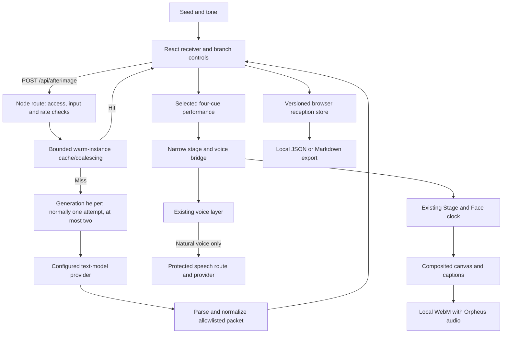

# AFTERIMAGE manual: from your first signal to the machinery inside

AFTERIMAGE turns a strange thought into branching microfiction that NOX can perform. You supply a seed, receive three possible signals, choose one of two endings, edit the words, and rehearse a 28-second cut. Its useful output is a short script, a performed scene, captions, and a local video export.

This guide follows the implemented receiver, shared schema, protected server route, cache, engine, store, and stage bridge. [AFTERIMAGE-DESIGN.md](AFTERIMAGE-DESIGN.md) records the original design. The operational explanations below come from the source code, including the existing voice, access, recorder, and concrete backend limits.

For the wider product, read [NOX-SYSTEM-MANUAL.md](NOX-SYSTEM-MANUAL.md). For environment setup, use [DEPLOYMENT.md](DEPLOYMENT.md). This guide contains configuration names and public source references, never credentials.

## 1. What the science-fiction framing means

“A transmission from a reality you haven't made” is a fiction premise. The interface makes choosing and rewriting a story feel like tuning an impossible receiver. A signal is a story option, not a real radio transmission or a prediction. An ending is an authored or model-generated possibility, not evidence about your future.

The creative loop is:

**Plant a thought → receive three signals → choose a branch → alter its ending → perform it → keep the cut.**

NOX's personality makes the process feel like making something with a little brother: expressions, gaze, movement, and his optional boyish voice respond to the script. The visible character does not establish consciousness, superintelligence, or general intelligence. The language model runs at a provider; the body runs in your browser. There is no worldwide uniqueness guarantee. The distinctive product choice is the combination of constrained branching fiction, physical acting, editing, and export.

The writer is directed to speak in NOX's first-person voice, with a hook, complication, reveal, and a meaningful choice of endings. Story labels should name the actual possibilities, rather than repeating Signal One or Ending A. These are creative instructions, not hard guarantees of writing quality; you can edit the lines or request a new take.

AFTERIMAGE suits eerie reel openings, speculative microfiction, a short scene hook, or a playful alternate ending. It is not a video-generation service: it stages NOX and the effects already supported by his world. It does not browse, inspect your desktop, or understand your camera preview.

## 2. Make your first cut

The receiver opens with a prepared first-contact story, ready to rehearse even when cloud AI is locked.

1. Open the workspace at `/app#afterimage`. The rail, command palette, and homepage invitation lead to the same view. Ctrl/Cmd+K opens the palette.
2. Try **First contact · authored example** first if you want to learn without making a text-model request. Its story was prepared in advance; it is not an AI response to whatever you type. The button adds the example to your local archive.
3. To receive fresh writing, enter a seed of 1–600 characters. A concrete disturbance works well: “Every night, the elevator arrives with one more button.” Avoid putting private information into a seed you intend to send to a provider.
4. Choose **Wonder**, **Uncanny**, or **Bold**. These are creative directions, not model upgrades.
5. Use **Receive a signal**. If owner access is locked, use **Unlock in Preferences** or open Settings, then unlock with the NOX owner token. A configured provider is also required. Unlocking and configuring a provider are different jobs.
6. Select one of the three signal branches. Read its premise and three acts, then choose either prepared ending.
7. Use **Edit this cut**, change the four selected lines, then select **Apply edits**. Every line must contain text and is bounded to 90 characters. Short lines leave more room for acting and silence.
8. Use **Rehearse**. NOX performs three acts followed by the chosen ending. Use **Stop** to end the performance and speech; another rehearsal begins again from the first act. On phones and tablets, the stage scrolls into view and a fixed **On air** bar shows elapsed time and **End performance**, so the stop control stays within reach.
9. Try the other ending or another signal. Choosing, editing, and replaying the saved packet do not ask a text model to write again. Optional natural voice has its own quota behavior.
10. Use **Export script**, **Export reception**, or **Capture 28s**. Capture opens the existing clip preview when it finishes; **Save clip** downloads its WebM with enabled Orpheus audio. Browser/OS speech cannot be captured by this path.

An example seed is useful because it anchors the fiction in a simple object, introduces a change, and leaves the explanation open. You remain the editor: discard a weak branch, change a line, or receive a new take rather than treating the first model result as final.

## 3. Every receiver control

These are the receiver's visible controls. An arrow, music note, or playback symbol may appear beside the label.

| Control or state | What it does | Network and quota consequence |
|---|---|---|
| Seed | Supplies the starting idea; 1–600 characters | Sent when you receive a live packet |
| Wonder | Requests surprising, curious speculative fiction | Changes the next text generation |
| Uncanny | Requests subtle fictional unease | Changes the next text generation; it does not enable camera vision |
| Bold | Requests a more decisive, dramatic creative turn | Changes the next text generation |
| Receive a signal | Requests a complete branching packet from the configured text provider; becomes Receiving… while busy | Normally one upstream text request on a cache miss; one narrowly permitted second attempt is explained below |
| Cancel reception | Stops waiting for the current generation and retains the seed | Cancellation cannot promise a provider refund |
| New take | Appears on model-generated receptions and changes the take associated with the entered seed and tone | Can cause fresh generation; it is not a local rewrite |
| First contact · authored example | Loads and archives the prepared story with an explicit authored label | No text-model operation; natural speech can still use its provider |
| Signal selection | Chooses one of three story paths | Local |
| Ending selection | Chooses one of that signal's two endings | Local |
| Edit this cut | Opens/closes four line editors initialized from the selected cut | Local |
| Apply edits | Saves four nonempty lines, each at most 90 characters, to the selected reception | Local; an edited natural-voice script may need fresh speech audio |
| Rehearse | Performs the four scheduled cues from the beginning | Local acting; optional speech is separate |
| Stop | Ends the active performance and speech; during capture it also finalizes the owned recording | Prevents later local cues; does not promise a provider refund |
| Capture 28s | Records a complete rehearsal and opens the existing clip dialog when finished | Local video with enabled Orpheus audio |
| Voice on/off | Enables/stops the same voice engine selected in Preferences | Natural speech uses its own quota; captions remain available |
| Export script | Downloads the selected script, timing, scenes, and captions | Local download |
| Export reception | Downloads the packet and reception metadata as JSON | Local download; may include the seed and edits |
| Reception archive title | Restores that packet, selected cut, edits, seed, and tone | Local |
| Archive × / Delete reception | Removes that local record | Does not retract provider data or previously downloaded files |
| What is this machine actually doing? | Expands the explanation of writing, cue timing, quota, and caption/audio limitations | Local |
| Provider/model/timing/cache/attempt information | Shows actual request metadata; a two-attempt result says written in 2 attempts | Describes measured execution, not intelligence or story quality |

The three branches and their endings have labeled buttons below the lattice. You can also click a signal or ending node in the graph; nodes cannot be dragged or connected, and graph zoom/pan gestures are disabled. The buttons provide the keyboard-accessible selection path. Seed, tone, branch, ending, and editing controls are disabled while receiving or performing so the active cut stays consistent.

**New take** increments a hidden variation number from 0 through 1024, wrapping back to 0. Editing the seed resets it to 0. There is no separate variation slider. **READY**, **COMPOSING**, and **PERFORMING** describe receiver state. The performance strip shows **SELECTED CUT**, **ON AIR**, or **CUT COMPLETE** with elapsed time out of `00:28`. **MODEL-GENERATED SIGNAL** and **AUTHORED FIRST CONTACT** identify the actual source; the default prepared preview says **NO AI REQUEST**.

**Tone, conversation mode, and emotion are different.** Tone shapes the next AFTERIMAGE story. NOX's existing Companion/Director/Uncanny mode shapes ordinary conversation and aspects of speech. A cue's emotion tells his face how to act during one moment. Selecting an Uncanny story does not grant new tools or change the authorization boundary. Likewise, the stage's **Signal** appearance changes his body, while the receiver's three signal choices select stories.

## 4. The existing stage switches

AFTERIMAGE borrows NOX's stage rather than building a second character engine. These controls already exist in the workspace.

| Control | Meaning and practical use |
|---|---|
| Presence | The established soft, expressive face and legless blob |
| Liquid Metal | NOX's body with a flowing chrome material; his gaze, face, and gesture vocabulary remain the character's |
| Signal | A faceless liquid core; use it for a more abstract transmission |
| Glow | Changes visual intensity from 0 to 100; it is not an AI confidence setting |
| Gravity | Lets NOX fall and bounce after release; ordinary scene use stays active until stopped/reset |
| Spotlight | Darkens the frame around a pointer-following light |
| Orbit | Adds a small orbiting universe around the character |
| Echo | Draws a faint second presence in the frame |
| Takeover | Enlarges NOX inside his own stage; it grants no computer control |
| Reset | Resets the scene; Escape also resets outside text fields/dialogs |
| Film mode | Uses the portrait presentation frame; F toggles it outside fields/dialogs |
| Voice on/off | Enables or stops the selected speech engine; captions remain available |
| Camera | Starts/stops a local camera preview after browser permission |
| Record clip / Stop & save | Records the composited stage, then opens a local clip preview/download |
| Light/Dark | Changes the room theme; it does not change the model |

Ordinary scene buttons toggle their effect when clicked again. Gravity persists; the other ordinary programs last ten seconds. AFTERIMAGE instead schedules its own four seven-second cues, resetting the previous scene and applying the next accepted action as the cut advances. Starting ordinary chat, selecting another scene, navigating away, or hiding the tab stops the AFTERIMAGE performance. This keeps two controllers from directing the same stage at once.

Set your appearance, glow, frame, and optional camera before recording. The existing recorder locks frame sizing while recording, so save the clip before changing Film mode. It records at 30 frames per second, selects a supported WebM codec, and stops automatically after 60 seconds. AFTERIMAGE's capture bridge stops the recording it started after its 28-second cut, or earlier if you stop/interrupt the performance. **Capture 28s** is unavailable while another recording is active or when canvas recording is unsupported. Capture errors are shown in the receiver.

Poke, drag, shake, and proximity reactions are local character behavior. With the stage focused, arrow keys move NOX and Space greets him; the face also supports a double-click wink. Use these for rehearsal, but remember that a manual scene change interrupts the scheduled performance. The stage timecode is elapsed stage time, not provider latency.

The owner selected always-on NOX animation. There is no website motion switch, and this choice does not modify the operating system's reduced-motion setting. Some surrounding interface transitions can still follow that preference.

## 5. Access, model, and voice settings

Public visitors use `/guest` (or a default workspace without an owner session).
Chats, scratchpad notes, remembered state and receptions use fresh in-memory
storage; refresh ends the visit. Owner mode at `/owner` uses the existing key
and signed session to open this browser's saved archive. Guest mode never reads
that archive, including when the same browser already has an owner cookie.
Owner data remains local plaintext, not an encrypted cloud account or shared
database. Signing out switches to a fresh guest page. Owner expiry rejects
private requests rather than treating their context as a guest request.

The public Groq trial uses quick replies and at most eight recent turns, with
no owner notebook, facts or old-chat summary. New AFTERIMAGE writing and
summaries remain owner-only. Guests can rehearse and capture the authored
example and make temporary local edits. Public chat and voice have separate
bounded rate counters. Free provider quotas can still interrupt a visit.

Orpheus speech is now public when the server's Groq voice is configured. Owner
unlock is not needed to hear NOX. The public path is bounded to four requests
per client and twelve total per minute in each warm process; other serverless
instances have separate counters. Free provider quotas still apply. Legacy
paid speech remains owner-only. Troy is the default, with Austin and Daniel as
alternate voices. No gender-preference label is shown in the interface.

Open **Settings** or **Preferences** to inspect connection and speech choices.

| Setting | What to choose or understand |
|---|---|
| Owner access / Unlock | Enter the NOX access token, not a Groq or other provider API key |
| Lock cloud access | Ends the browser's owner session; local scenes and prepared stories remain usable |
| Conversation brain | Selects an available, server-configured provider; the AFTERIMAGE request can name a configured provider ID |
| Automatic AI | Uses the server's configured preferred provider |
| Scripted demo | Explicitly selects prepared ordinary conversation; it is distinct from a fresh AFTERIMAGE generation |
| Browser voice | Uses the browser/OS speech engine; voice quality and availability depend on the device |
| Natural voice | Uses the configured cloud speech service, normally Groq Orpheus in this setup |
| Orpheus character voice | Troy is the boyish default; Austin, Daniel, and Hannah are other exposed options |
| Browser voice selector | Chooses an installed/available browser voice; Automatic prefers suitable male English voices when found |
| Try this voice | Auditions the current voice; natural voice can use speech quota |
| Developer inspector | Shows the existing ordinary-chat connection and packet; it is not an AFTERIMAGE provider console |

An owner unlock creates a signed browser session lasting up to twelve hours. On the hosted site its cookie is Secure, HttpOnly, host-bound, and SameSite=Strict. The server validates the session; the presence of a button or a localStorage value does not authorize a request. Browser storage does not contain a provider API key. A local development server can be configured differently; the hosted owner's session remains the relevant access boundary.

Locked, unconfigured, receiving, live, authored, failed, and stopped are meaningful states. A prepared example must never be passed off as a live response when access or a provider fails. The correct recovery is to unlock, configure a provider, wait for its limit, or consciously use the authored example.

AFTERIMAGE is a dedicated writing task. Ordinary chat's Quick/Balanced/Deep selector is not a promise that it changes the receiver's structured packet or timing. Provider URLs, credentials, and models are selected by server configuration; the browser cannot supply a custom provider endpoint or execute a new tool.

## 6. Why one reception contains six films

Each reception contains three signals. Each signal contains three shared acts and two alternative ending cues:

```text
Signal 1: act 1 → act 2 → act 3 → ending A or ending B
Signal 2: act 1 → act 2 → act 3 → ending A or ending B
Signal 3: act 1 → act 2 → act 3 → ending A or ending B
```

Three signals multiplied by two endings gives **six selectable cuts from one successful text-model result**. A normal reception uses one upstream writing request; a specific provider-side structured-output rejection can trigger exactly one additional attempt. A cut does not require four writing requests or a new request when you select the other ending. There are fifteen cue objects in the complete packet: five per signal.

The performance schedule is fixed:

| Cue | Time in the cut | Job |
|---|---|---|
| Act 1 | 00:00–00:07 | Establish the disturbance |
| Act 2 | 00:07–00:14 | Complicate or develop it |
| Act 3 | 00:14–00:21 | Prepare the turn |
| Selected ending | 00:21–00:28 | Complete the chosen possibility |

Seven seconds is a rehearsal schedule, not a word-alignment engine. Shorten lines when the delivery outruns a scene, or allow silence when it finishes early. Text can be compelling without filling every second.

The engine's `buildSelectedPerformance(packet, signalIndex, endingIndex, editedLines)` builds the four-cue cut. It returns its title, selected labels, cues, full script, caption, and a `durationMs` of `28000`. It does not generate new story text. Local editing modifies the selected lines; receiving another packet is a separate writing operation. The current store keeps one selected set of four edited lines per reception. Changing signal or ending resets those edits unless replacement lines are explicitly supplied, so export a version you want to preserve before changing the branch.

## 7. Speech, mouth movement, and honest synchronization

The engine joins four lines of at most 90 characters with three newline separators. The complete spoken script therefore fits within **363 characters**: `4 × 90 + 3`. The bridge calls NOX's speech layer once for the whole script, rather than requesting speech separately at each seven-second cue.

There are three distinct counts:

- **Text generation:** one AFTERIMAGE receive operation, normally one upstream writing request on a cache miss. Its narrowly bounded retry can make this two upstream requests; it does not generate each branch separately.
- **Application speech:** one call to `voice.speak` and, for natural voice, one `/api/speech` request for the selected full script.
- **Speech-provider clips:** AFTERIMAGE sends four validated lines and their emotions. Each line receives its own vocal directions. Groq inputs are bounded to 200 characters including tags, and the returned WAV clips are joined in order. The bounded five-minute line cache can reuse unchanged acts when you choose another ending. A four-line cut can therefore require four upstream speech requests on a cold cache. “One speech call” at the application layer does not mean one provider clip or free speech.

Natural-voice mouth movement uses the energy envelope extracted from the returned WAV and the audio player's current playback time. It reacts to the actual audio amplitude; it is not a phoneme recognizer or proof that each word matches a particular scene cue. If a usable audio envelope is unavailable, the voice layer has an estimated timeline fallback.

Browser voice uses speech boundary events when available and estimated text timing otherwise. Browser voices can behave differently across devices. Some browser/OS voices are network-backed, so Browser voice should not be described as a universal offline guarantee even though NOX does not call its own cloud speech endpoint for that engine.

The four cue transitions still occur at approximately 0, 7, 14, and 21 seconds. Cloud audio must first be generated and played, and speaking duration varies. This version does not promise word-level alignment, a seven-second pause between spoken lines, or a narrated audio track inside the built-in WebM. Stopping or ending the performance stops its speech.

Keep **Voice off** while trying many visual variations if you want to conserve natural-voice quota. Replays with natural voice can make a speech request even though they make no text-model request; an identical script/voice/acting combination may reuse cached audio in the same warm server process.

## 8. Recording and exports

The existing composition order is source background → scene → optional camera preview → NOX → visible captions. The recorder captures this canvas; it does not capture the whole webpage, graph, editor, settings, or system audio.

For a built-in clip, choose the branch and ending, finish local edits, set the frame, and use **Capture 28s**. The bridge's `recordAndPlay` starts a 28-second performance and stops the recorder it owns. Once the clip is finalized, the existing clip dialog opens automatically with native playback controls and **Save clip**. This preview/download flow is the same one used by ordinary stage **Record clip** / **Stop & save** recording. Stopping early can save a shorter clip rather than a complete 28-second cut.

The recorder now combines canvas video with a cloned Web Audio track carrying Orpheus playback. Voice must be enabled and natural speech must succeed for audible speech to appear. No microphone or unrelated system audio is captured. Browser/OS speech is not available to Web Audio, so that fallback produces video only. Older downloads remain silent; make a new recording for audio. Stopping a recording releases its cloned track without stopping ordinary playback.

If Camera is on, the visible local preview appears in the canvas and therefore in the downloaded clip. No camera frame is attached automatically to an AFTERIMAGE model request. A local recording can still contain identifying material if you put it in the frame.

**Export script** downloads `nox-afterimage-script.md`: the selected editable script, cue start/end timecodes, each emotion/action, caption, anchor, seed/tone, and authored/live source. **Export reception** downloads `nox-afterimage-reception.json`: the current reception and full packet, including its selected cut and edits. The store API additionally supports exporting its versioned collection; there is no export-all archive button in this receiver. These files are portable records of the writing. Downloaded files remain after you delete the corresponding browser record.

## 9. What is stored and what leaves the browser

The store keeps at most twelve receptions under `nox.afterimage.v1`, with newest additions first. A reception contains an ID, creation timestamp, full packet, seed, tone, source label (`live` or `authored`), optional metrics, selected signal and ending, and optional edited lines. Records are normalized before use; invalid records are ignored, duplicate IDs are discarded, and unsupported store versions are not treated as valid. Receiving a story, explicitly loading First contact, choosing a branch in the initial prepared preview, or applying edits adds/updates its archive entry.

If persistent storage is unavailable or a write fails, the store keeps an in-memory session copy and the archive says **temporary**. Receptions remain temporary until browser storage is allowed and the page can initialize a persistent store. Export anything you want to keep before reloading or leaving: the temporary copy does not survive a reload, and allowing storage does not automatically transfer it. This archive is not a cloud backup.

| Information | Location or destination |
|---|---|
| Seed, tone, variation, selected provider ID | Sent to NOX's server for Receive a signal; the appropriate writing input goes to the chosen provider |
| Provider key and owner-session signing secret | Server configuration only |
| Generated packet and chosen cut | Returned to the browser and optionally stored locally |
| Reception archive and edits | Plaintext browser storage; no cloud synchronization |
| Full selected speech script, acting mode, emotion, voice | Sent to `/api/speech` when natural voice is enabled; speech text goes to the speech provider |
| Camera frames | Local preview/canvas capture; not included automatically in text generation |
| Script, JSON, and WebM exports | Files downloaded to your device |

AFTERIMAGE does not automatically attach your chat transcript, saved facts, notebook excerpts, or camera frames to its writing request. Its request is deliberately small. If you paste a private notebook passage into the seed, however, that passage becomes submitted text.

localStorage is plaintext and scoped to the site's origin and browser profile. Localhost, a preview deployment, and the production domain do not share one archive. Another browser, another device, cleared site data, private browsing, denied storage, or storage eviction can make saved receptions unavailable. Export what you want to preserve. The twelve-reception bound is a convenience, not unlimited archival storage.

Delete removes the selected browser record. It does not erase another device's export, retract data already sent to a provider, or delete a cloud provider's logs. NOX's ordinary **Clear memory**, chat Library deletion, and notebook document deletion are separate operations; they are not a universal delete-everything switch for AFTERIMAGE.

## 10. Beginner foundations

A **browser** runs the controls, graph, local store, and character animation. A **server** validates incoming requests and calls providers using private configuration. An **API** is the defined interface they use to exchange data.

The receiver submits a JSON request, which is text representing structured data. JSON is not executable code. Parsing checks whether the text has valid syntax; validation checks whether its fields, values, counts, and lengths are allowed. Both are necessary. A valid-looking model answer is still untrusted input.

A language model performs **inference**: generating text from its existing learned weights and the supplied instructions. AFTERIMAGE does not train or fine-tune a model, and local editing does not update the model's weights. Saving a reception stores data for the application.

Characters, UTF-8 bytes, and model tokens are different units. A 600-character seed fits the field limit, but the full JSON body also has a byte limit. A model's token budget controls generation work and can be exhausted before a packet is complete. More animation has no effect on a model's reasoning ability.

An **allowlist** names the few values accepted by software. It is stronger than asking the model politely not to invent tools. An **abort signal** marks work obsolete so requests or cues can stop; it cannot promise to undo inference already performed upstream.

## 11. Founder architecture and data flow

AFTERIMAGE adds a narrow writing/performance instrument to the existing app. It does not replace ordinary conversation or let the language model run the animation clock.



The React receiver owns form state, explicit source labels, choices, and UI transitions. The store owns bounded persistence. The pure performance controller owns the four-cue schedule and cancellation. The bridge maps those cues to the existing Stage and voice interfaces. Stage retains ownership of its drawing and physics clock.

This division prevents two animation loops from competing for NOX's body. When playback stops, a stale cue must not revive an old scene. Similarly, a generation arriving after a newer request must not replace the newer result. Navigation, tab visibility, ordinary chat, manual scene changes, and disposal must end the relevant work.

The receiver and graph load lazily when you enter the view. A small initial page does not mean those later dependencies are free to download or render. Keep the graph's motion with the interface and the character's motion with Stage; do not let GSAP, React Flow, and the performance controller all write the same transform.

## 12. The structured writing contract

The request contract for `POST /api/afterimage` is:

```json
{
  "seed": "A concrete fictional disturbance",
  "tone": "uncanny",
  "variation": 0,
  "provider": "groq"
}
```

`seed` and `tone` are required. `variation` is an optional integer from 0 to 1024, defaulting to 0, used to request another creative take. `provider` is optionally `groq`, `gemini`, or `nvidia`, and must be configured on this server. Unknown request fields are rejected. The request cannot specify an API key, URL, arbitrary model, camera frame, transcript, notebook, or new tool. Omitting the provider uses an eligible preferred provider, otherwise Groq when configured, otherwise the first eligible configured provider. The legacy OpenAI adapter is not eligible for this feature.

The normalized packet contains:

| Field | Bound and meaning |
|---|---|
| `title` | Up to 80 characters |
| `anchor` | Up to 160 characters; the idea holding the fiction together |
| `signals` | Exactly three signal objects |
| Signal `label` | Up to 48 characters |
| Signal `premise` | Up to 180 characters |
| Signal `beats` | Exactly three cue objects |
| Signal `endings` | Exactly two ending objects |
| Ending `label` | Up to 48 characters |
| Cue `speech` | Nonempty bounded text, up to 90 characters |
| Cue `emotion` | One accepted expression value |
| Cue `action` | One accepted stage action |
| `caption` | Up to 280 characters for the cut/post |

The shared emotion allowlist is `neutral`, `happy`, `curious`, `skeptical`, `sleepy`, `uncanny`, `annoyed`, `surprised`, and `shy`. The action allowlist is `none`, `gravity`, `spotlight`, `orbit`, `echo`, and `takeover`.

These are data labels. `takeover` invokes a known stage effect; it is not an operating-system instruction. The current normalizer rejects missing/unexpected structures, incorrect counts, empty text, and wrong cue value types; text is cleaned and bounded. An unknown emotion string becomes `neutral`, and an unknown action string becomes `none`. The provider schema asks for accepted values, while the normalizer supplies a safe fallback if a non-strict provider returns an unknown string. No generated JavaScript, URL field, DOM command, or invented action is dispatched. Words that look like code or URLs inside speech remain text. The response includes `{packet, metrics: {provider, model, totalMs, cacheHit, attempts}}`. New successful generations have `attempts` equal to 1 or 2; older saved receptions may omit this optional metric.

All three supported providers return one complete, nonstreamed AFTERIMAGE packet. The task has a 2,700-output-token budget. Groq uses the configured ordinary model, defaulting to `openai/gpt-oss-20b`, with low reasoning where the model supports that setting. The selected Gemini or NVIDIA model is likewise server-configured. This dedicated task does not switch to the ordinary Deep-chat model. A token budget is a ceiling, not a guarantee that generation finishes with a valid packet.

### The narrowly bounded second attempt

Structured writing can fail at the provider even when the request is valid. The generation helper normally asks the provider once. It makes **exactly one additional attempt only when all three error fields match**: `code === 'invalid_json'`, `providerStatus === 400`, and `providerCode === 'json_validate_failed'`. The shared deadline/cancellation signal must still be active, and the error cannot be a `TypeError`, `SyntaxError`, `TimeoutError`, or `AbortError`. This is the explicit provider-side structured-output rejection observed with Groq; it is not a general retry for every bad result.

Authentication/credential failures, exhausted quota, timeouts, output limits, JSON parsing `SyntaxError`s, and local normalizer failures do **not** trigger this second attempt. Nor does a second structured-output rejection cause a third attempt. The original shared twenty-second deadline and abort signal cover both attempts; the retry does not reset the clock. If writing still fails, the receiver shows the sanitized failure and keeps the seed. No failed packet is cached or presented as a successful story.

`server/afterimage-generation.mjs` exposes `requestAfterimageGeneration`, which returns `{packet, attempts}` only after successful normalization. The cache retains that successful result, including its original writing-attempt count. Consequently, a cached reception can show both **warm cache** and **written in 2 attempts**: two attempts were used to write the original take, not to fetch that cached copy. An older reception without `attempts` should not be interpreted as proof of a particular count.

Model prompts guide the writing, schema, and fictional framing, but prompts are not a security boundary. The real boundaries are server authentication, server-owned provider selection, request/output validation, escaped text rendering, and the finite action dispatcher. A constrained schema can stop invented executable actions; it does not guarantee truthful text, perfect originality, or a good story. The founder still needs editorial review and testing.

## 13. Quota, caches, rate limits, and latency

No new paid service is required by AFTERIMAGE. Local choices, edits, scene playback, browser storage, and audio/video capture run in the browser. Hosted text and natural speech use provider accounts, whose free quotas, permissions, terms, and availability can change. The optional legacy OpenAI adapter is not part of the free-only path unless deliberately configured.

One cache-miss reception can be a larger text response than a quick chat: it contains three signals and fifteen cue objects. “One request” is not “one token,” and generating six selectable cuts does not make the work zero-cost. The permitted second writing attempt can consume additional provider quota. Different endings and local edits conserve text-generation quota because they reuse the successful returned packet.

The HTTP server limits JSON bodies to **16,384 bytes** and checks JSON content type. AFTERIMAGE adds the 1–600-character seed bound, known tone values, variation validation, configured-provider selection, and strict packet checks. Bad bodies fail before useful playback is available. Client field limits improve usability; server checks are the enforcement boundary.

The shared chat/speech/summary/AFTERIMAGE guard allows **30 application API requests in a 60-second window per warm process**, across those routes. AFTERIMAGE cache hits still count against this guard. Its internal second writing attempt stays within the same receive operation; upstream provider requests and tokens still count toward the provider's own limits. This is not thirty requests per visitor or a globally coordinated limit. Serverless instances can have separate counters. The unsuccessful-owner-unlock throttle is also process-local: eight failures in a five-minute window trigger a wait, with a bounded map of tracked addresses.

AFTERIMAGE's cache has a **60-second lifetime**, up to **twelve completed entries**, and a combined **512-KiB serialized UTF-8 budget**. It also permits up to **twelve distinct pending jobs**; another distinct job receives `429` while that capacity is full. The cache key includes host, seed, tone, variation, provider, and model. Identical in-flight receivers can share a result, and `cacheHit` covers both completed reuse and pending coalescing. A variation deliberately changes the key. Only successfully normalized generation results are retained, including their `attempts` value; failed/canceled work is not retained as a usable packet.

Each receiver can cancel independently. Shared upstream work is aborted when all receivers leave; canceling one receiver does not discard a result still needed by another. This is a warm-instance optimization, not a durable database, global cache, or guarantee that every repeat avoids provider work. It cannot promise an upstream provider refunds work already performed.

The existing **speech cache** has a five-minute lifetime, up to twelve completed entries, and a combined twelve-MiB byte budget. Its key includes speech provider/key identity, voice, and acting text/mode/emotion. Identical pending work can share its result within the bounded implementation. Failed work is not a successful cached clip. Restarting or reaching another server instance can remove the benefit. Editing words or changing voice/acting can make a new speech request necessary.

Provider text and speech adapters have a twenty-second deadline. The AFTERIMAGE generation operation shares one twenty-second deadline across any permitted two-attempt writing path. There is no fixed end-to-end latency guarantee: network time, cold starts, queueing, packet length, validation, a retry, and audio generation all matter. AFTERIMAGE's 28 seconds is the performance duration after playback begins, not how quickly a provider must answer. Mouth amplitude, graph transitions, and prompt length are separate issues.

The real provider/model, `totalMs`, `cacheHit`, and optional `attempts` are useful operational facts. `totalMs` describes this receive operation; a cached result's attempt count describes the original writing. These values must not become a fictional accuracy score, intelligence meter, or fake live telemetry. A cache hit means reuse/coalescing in the application, not that the provider learned your story. A successful retry guarantees neither better prose nor originality.

Groq documents request, token, and audio limits and states that limits apply at organization level. Check the account's current Limits page rather than treating a public table as your entitlement. Natural speech has its own limit and may require accepting Orpheus's terms/model permissions. [Groq rate limits](https://console.groq.com/docs/rate-limits), [Groq text to speech](https://console.groq.com/docs/text-to-speech).

## 14. Sources, libraries, and the file atlas

The visual system uses real open-source libraries and adapted source assets. Upstream code provides effects and rendering machinery; NOX's application supplies character behavior, routing, validation, storage, and capture. Adding a renderer or animation library does not add a model capability.

| Source or library | Role in NOX | Reference |
|---|---|---|
| liquid-logo | Original liquid material shader/presets adapted to NOX's established silhouette and chrome appearance | [Upstream repository](https://github.com/collidingScopes/liquid-logo) |
| ShaderGradient | Animated source water-plane background, adapted to the dark teal room | [Upstream repository](https://github.com/ruucm/shadergradient) |
| Liquid Glass JS | Source glass shaders/styles adapted behind accessible native controls | [Upstream repository](https://github.com/dashersw/liquid-glass-js) |
| React Three Fiber / Three.js | React-driven 3D scene rendering; not the language model | [R3F repository](https://github.com/pmndrs/react-three-fiber) |
| GSAP / Lenis | Homepage choreography and coordinated scrolling | [GSAP](https://gsap.com/docs/v3/), [Lenis repository](https://github.com/darkroomengineering/lenis) |
| React Spring | Existing bounded interactive 3D transforms | [Official documentation](https://react-spring.dev/docs) |
| Motion | Existing React UI entrances and selection/dialog transitions | [Official documentation](https://motion.dev/docs/react) |
| Codrops scroll typography | Adapted source letter and pinned chapter effects on the homepage | [Upstream repository](https://github.com/Codrops/OnScrollTypographyAnimations) |
| React Flow | Receiver branch-node/edge visualization; the npm package is `@xyflow/react` | [Quick start](https://reactflow.dev/learn), [ReactFlow component API](https://reactflow.dev/api-reference/react-flow) |

React Flow supplies an interactive graph component. NOX's packet-to-node mapping gives its nodes and edges story meaning. It is not a branching-story AI service or the stage performer. The receiver uses `@xyflow/react`, pinned to `12.12.0` in `package.json`, and imports the library stylesheet. Its lattice adapts the official custom-node/animated-edge approach. No React Flow Pro subscription is required.

`public/vendor/sources.json` records the exact inspected upstream commits; runtime package versions are pinned separately in `package.json`. Read [SOURCE-ASSETS-GUIDE.md](SOURCE-ASSETS-GUIDE.md) for the rendering chain and retained licenses. The homepage's newer character/material implementation should be read directly when changing its shader geometry; this manual does not treat an earlier source guide as an immutable description of later code.

| File | Responsibility |
|---|---|
| `docs/AFTERIMAGE-DESIGN.md` | Feature and security contract |
| `client/workspace.jsx` | Existing React toolbar, palette, notebook, and system explanation; receiver navigation is integrated here |
| `client/afterimage.jsx` | Receiver form, source labels, branch/ending/edit controls, archive, and export UI |
| `client/afterimage-lattice.jsx` | Lazy React Flow mapping from actual signals/selected endings to graph nodes and edges |
| `client/afterimage-example.js` | Explicitly authored First contact packet |
| `public/app.html`, `public/js/navigation.js` | Workspace structure and hash-view navigation |
| `public/js/app.js` | Shared Stage, voice, recorder, connection, and ordinary-conversation orchestration |
| `public/js/afterimage-engine.js` | Selected cut builder, four-cue performance controller, and Markdown export |
| `public/js/afterimage-store.js` | Versioned, bounded reception storage and JSON export |
| `public/js/afterimage-bridge.js` | Narrow mapping from performance cues/capture to the existing app machinery |
| `shared/character.js` | Established emotion/action allowlists shared by browser and server |
| `shared/afterimage.js` | AFTERIMAGE provider schema, exact input checks, and packet normalization |
| `server.mjs` | Host/origin/session/content/body/rate checks and protected API routes |
| `server/providers.mjs`, `server/ai.mjs` | Server-owned provider adapters, prompts, model selection, and text-generation behavior |
| `server/afterimage-generation.mjs` | Successful packet normalization plus the single narrowly gated additional writing attempt and original attempt count |
| `server/session.mjs` | Signed owner sessions and bounded unlock throttle |
| `server/cache.mjs` | Existing bounded warm-process speech cache |
| `server/afterimage-cache.mjs` | Dedicated short-lived packet cache, pending-cap guard, and shared cancellation |
| `server/speech.mjs`, `server/wav.mjs` | Speech-provider calls, Orpheus splitting, and WAV joining |
| `public/js/voice.js`, `public/js/speech-envelope.js` | Speech playback, cancellation, amplitude/boundary/estimated mouth timing |
| `public/js/stage.js`, `face.js`, `face-art.js` | Canvas composition, physical programs, expressions, and drawing clock |
| `public/js/camera.js`, `public/js/recorder.js` | Local preview and canvas-plus-Orpheus WebM lifecycle |
| `client/home.jsx`, `home-scroll.js`, `source-scene.jsx`, `source-logo.jsx`, `liquid-character.js` | Homepage invitation/choreography and sourced visual implementations |
| `public/vendor/`, `public/vendor/sources.json` | Vendored source examples/shaders, retained license notices, upstream provenance |
| `package.json`, `scripts/build-client.mjs`, `scripts/build-vercel.mjs`, `vercel.json` | Dependencies, lazy client bundles, and deployment packaging |

`client/workspace.jsx` mounts the receiver only for `#afterimage`; `public/js/app.js` connects the shared bridge to its existing Stage, voice, recorder, and authenticated request closures. The receiver never owns provider credentials or a second animation clock.

## 15. Recover from a problem

| Symptom | Meaning and next action |
|---|---|
| Owner access is locked / `401` | Unlock in Settings with the NOX token; a provider key is not the owner token |
| Provider not configured / `503` | Add the appropriate server environment key/model configuration and restart/redeploy; authored playback remains an explicit option |
| Wrong origin / `403` | Open NOX at its configured address rather than calling the hosted API from another site |
| Invalid input / `400` | Check a nonempty seed, known tone, valid variation, and configured provider |
| Oversized JSON / `413` | Reduce the request; the byte budget applies to the entire body |
| Wrong content type / `415` | The API expects JSON |
| Rate guard / `429` | Stop repeated receiving/auditioning and wait; multiple routes can share the warm-process counter |
| Sanitized provider failure / `502` | Writing can fail because of quota, access, timeout, output limits, or an unusable packet. Only the exact provider `400/json_validate_failed` rejection receives one bounded extra attempt; other failures stop immediately. An authored example is not substituted silently |
| written in 2 attempts | The original take needed the permitted second writing attempt; this label can remain on a cached result. It is not a quality score |
| Text works, Troy does not | Natural voice has separate access, terms, model permission, and quota; choose Browser voice or rehearse with captions |
| Sound and cue timing differ | Seven-second scene cues are approximate rehearsal timing; shorten/edit lines and rehearse again |
| Downloaded clip has no sound | Make a new recording with Orpheus and Voice enabled; browser speech, unavailable Web Audio, a speech failure, or an older export can produce video without audible speech |
| A tab switch stops the cut | This is deliberate cancellation behavior; return and replay |
| A saved reception is missing | Check the same origin/browser/profile and whether storage was cleared/denied or the bounded archive evicted older work; use exports for preservation |
| WebM recording is unavailable | Use a browser with supported canvas/MediaRecorder/WebM capability or record externally with OBS |

The server deliberately returns safe categories instead of forwarding raw provider errors. This reduces accidental exposure of provider details; diagnosing account configuration should use the provider console and server logs without pasting credentials into chat or the browser.

## 16. Compact glossary

| Term | Plain meaning |
|---|---|
| Seed | The starting idea you submit |
| Signal | One of three fictional story branches |
| Reception | A full received or authored packet plus its local metadata and selections |
| Anchor | The compact idea keeping the fiction coherent |
| Beat/act | A scheduled story moment |
| Cue | Speech plus one accepted emotion and stage action |
| Cut | Three acts and the selected ending, performed over 28 seconds |
| Packet | Structured JSON returned by the writer/provider adapter |
| Schema | The required shape, field types, counts, and constraints of that packet |
| Allowlist | The finite accepted emotions/actions/values |
| Inference | Generating text or audio with an already-trained model |
| TTS | Text to speech; a separate operation from writing the story |
| Audio envelope | How recorded sound energy changes over time; used for mouth movement |
| Cache hit | Reuse or sharing of identical work inside the bounded application cache |
| Attempts | Upstream writing attempts used for the original successful take; 1 or 2 when recorded |
| Warm instance | A running server process that still has its in-memory state |
| Coalescing | Sharing one pending result among identical concurrent requests |
| Origin | The site's scheme, host, and port; a boundary for browser storage and requests |
| localStorage | Persistent, plaintext browser storage belonging to that origin/profile |
| WebM | The local video format used by the built-in recorder; new natural-voice recordings include an Opus audio track |
