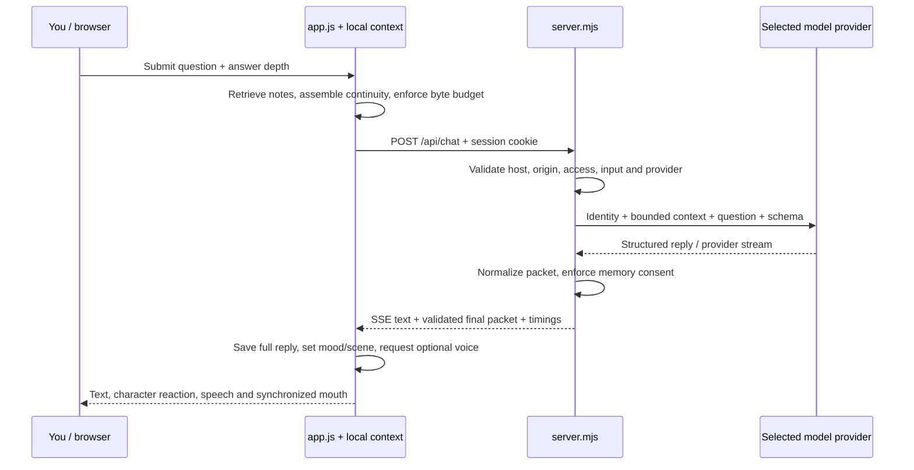

# NOX system manual: from first principles to founder-level understanding

Code baseline: NOX 0.8.0. External service documentation checked October 7, 2026. Start here for the architecture, then use [FOUNDER-GUIDE.md](FOUNDER-GUIDE.md) for the earlier implementation walkthrough and [DEPLOYMENT.md](DEPLOYMENT.md) for account setup.

NOX combines a fictional character, hosted language models, local context retrieval, optional voice, and a creation studio. His most convincing quality comes from connecting these systems carefully: immediate physical reactions, useful answers, continuity, and honest connection states.

This system does not establish sentience, artificial general intelligence, or superintelligence. It does not learn new model weights from your conversations. Its capability depends on the selected model, the evidence provided, and the software around it. Free services impose real limits. Treat greater usefulness as something to measure, rather than a claim inferred from his personality.

## 1. Learn the foundations first

**A browser** downloads the interface and runs client-side JavaScript. HTML gives the page its structure; CSS styles it; JavaScript reacts to clicks, keeps state, makes requests, and draws NOX. The Document Object Model, or DOM, is the browser's accessible tree of elements. A canvas is a pixel surface inside that tree: its drawing needs separate HTML labels and controls.

**A server** runs code outside the visitor's browser. Here, Node.js receives requests, validates them, checks access, calls providers with private keys, and returns results. Browser code is visible to visitors; server environment secrets must stay outside browser bundles. Moving a secret into an obscure filename does not make it private.

**An API** is a defined interface between programs. NOX's browser calls `/api/chat`; NOX's server calls Groq's API. A request has a method, URL, headers, and sometimes a body. A response has a status, headers, and a body. `401` means access was not accepted; `429` means a limit was reached; `502` here usually means an upstream operation failed.

**JSON** is a text format for data. For example, `{"speech":"Hello.","emotion":"curious","action":"none","memory":""}` is a character packet. `JSON.parse` converts JSON text into a JavaScript value; validation determines whether that value is usable. Parsing alone does not authorize an action.

**HTTP and HTTPS** carry requests. HTTPS adds authenticated, encrypted transport between endpoints. It helps protect data in transit; it does not hide information from the service receiving it, repair vulnerable code, or encrypt localStorage. An origin is the combination of scheme, hostname, and port. `localhost:3000` and the deployed HTTPS domain have separate storage.

**Asynchronous code** lets work finish later without blocking the entire interface. A promise represents a future result; `await` waits inside an async function. Several results can arrive out of order. NOX uses cancellation and turn versions so an old reply cannot animate him after you start a different conversation.

**Training** adjusts a model's numerical weights using many examples. **Inference** uses an already-trained model to generate a response. NOX performs inference through APIs. His prompt, memory, notebook and expressions are application features; adding a note supplies context and does not retrain the model.

**Tokens** are model-specific pieces of text, not necessarily words. Input tokens include instructions and context; output tokens cover generation, with reasoning accounting depending on the provider. A model's context window is its capacity, while NOX deliberately supplies a much smaller context. Characters, UTF-8 bytes and tokens are different units: Unicode and JSON overhead make a character count insufficient for an HTTP byte limit.

**Parameters** are learned numbers inside the model. A larger model can offer different capabilities, but parameter count alone does not prove better answers on your tasks. Prompts, source quality, decoding settings, latency, and evaluation all matter. The models run at the provider, not inside the small blob drawn in your browser.

## 2. Know the product and its boundaries

The homepage at `/` introduces the product, its actual capabilities, and its privacy boundaries. Its live character shares the same expression and gesture engine used by the workspace. The translucent 3D panels represent layers of presence, context and generation; they are a separate visual sculpture.

The workspace at `/app` has four hash-selected views: `#explore`, `#conversation`, `#scenes`, and `#library`. Hash navigation changes which panels are visible without inventing additional backend routes. Preferences handles owner access, configured providers and voice. The command palette opens with Ctrl/Cmd+K. The notebook and system explanation are React dialogs.

Conversation generates replies when a configured provider and owner session are available. The explicitly selected scripted demo remains a demo. Locked, loading and unconfigured states do not silently substitute repetitive scripted answers. Gestures and scene programs work locally even when AI access is locked.

Scene Studio includes expression previews, gravity, spotlight, orbit, echo, takeover, camera preview and clip recording. Takeover enlarges NOX inside his stage; it grants no operating-system access. The camera is a local preview, not model vision. The recorded WebM contains the canvas composition and captions, and is silent.

The Library saves conversations in this browser and supports searching, reopening, deleting and exporting them. The knowledge notebook accepts pasted text and `.txt`, `.md`, or `.markdown` files. It searches locally, then supplies selected excerpts with a question when enabled. It is not web search and has no cloud synchronization.

## 3. The code atlas

| File or directory | Job and connection |
|---|---|
| `public/index.html`, `public/app.html` | HTML entry points; accessible controls and mount points |
| `public/design.css` | Shared ivory/charcoal/teal tokens, dark theme, focus and motion rules |
| `public/home.css`, `public/workspace.css`, `public/style.css` | Page composition and established interface styling |
| `client/home.jsx` | React homepage, navigation, demonstrations, GSAP/Lenis setup, sculpture interactions |
| `client/sculpture.js` | Lazy Three.js scene and resource lifecycle |
| `client/workspace.jsx` | React islands: command palette, notebook, system dialog, theme toolbar |
| `public/js/app.js` | Workspace orchestration: send, perform, connection, media, history and preferences |
| `public/js/navigation.js` | Hash views, recent threads, Library search, deletion and export |
| `public/js/workbench.js` | Shared notebook instance, answer-depth preference and UI events |
| `public/js/stage.js` | Canvas clock, pointer handling, scene physics and composition |
| `public/js/face.js`, `public/js/face-art.js` | Reaction state, gesture detectors, pose selection and original drawing paths |
| `public/js/orb.js`, `orb-state.js`, `orb-shader.js` | Optional signal-core renderer and its bounded state |
| `public/js/landing.js`, `public/js/peek.js` | Homepage character placement and scroll-to-corner projection |
| `public/js/voice.js`, `speech-envelope.js`, `reply.js` | Speech engines, mouth timing and concise spoken preview |
| `public/js/camera.js`, `public/js/recorder.js` | Local camera lifecycle and bounded canvas WebM capture |
| `public/js/memory.js`, `history.js`, `knowledge.js` | Explicit facts, saved conversations, summary work and lexical retrieval |
| `public/js/connection.js`, `turns.js`, `stream.js` | Honest connection states, stale-work cancellation, browser SSE decoding |
| `public/js/brain.js` | Explicit offline demonstration; it is not the hosted brain |
| `shared/character.js` | Shared packet schema, depth budgets, memory-consent recognition, normalization and context/request limits |
| `server.mjs` | HTTP routing, host/origin/access checks, input limits, safe errors and API responses |
| `server/ai.mjs` | NOX identity, depth instructions, untrusted-context framing, memory consent and legacy OpenAI adapter |
| `server/providers.mjs`, `server/stream.mjs` | Groq/Gemini/NVIDIA adapters, server-owned model selection, provider SSE parsing |
| `server/session.mjs`, `server/cache.mjs` | Signed owner sessions, unlock throttle and bounded speech cache |
| `server/speech.mjs`, `server/wav.mjs` | Provider speech, emotion directions, splitting and valid WAV joining |
| `scripts/build-client.mjs`, `build-vercel.mjs`, `check.mjs` | Client bundling, explicit Vercel packaging and JS syntax checks |
| `tests/` | Behavior, provider, HTTP security, rendering-state, storage and deployment tests |
| `.env.example`, `vercel.json`, `package.json`, `package-lock.json` | Configuration names, deployment commands and pinned dependency resolution |

Read `shared/character.js` before changing either the brain or the body. The shared contract is what lets a model request an expression or scene without inventing arbitrary capabilities.

## 4. Trace a complete conversation turn



1. `send()` rejects empty input and concurrent sends. It keeps a locked user's draft and opens access settings. An exact takeover command can still trigger the local scene.
2. A new turn version cancels obsolete requests. The app aborts pending summary work, reads depth and mode, and combines memory, thread continuity and `knowledge.context(question)`.
3. `prepareChatRequest()` sanitizes context and checks the UTF-8 size of the complete JSON body against 16,384 bytes. It drops oldest history first, then notebook excerpts, bridge, facts and summary, preserving the current question.
4. The app saves the user turn and creates a draft response. `/api/chat` receives JSON; the server also enforces the 16 KiB body limit and a 1–1,200-character question limit. Client checks are convenience; server checks are the boundary.
5. The server selects only a configured provider ID. The caller cannot supply a provider endpoint, API key, arbitrary model, or new tool. Groq Deep uses the configured deep model; other providers keep their configured model.
6. The provider receives NOX's identity, answer instructions, untrusted continuity data, recent turns and the question. Identity states that his name is NOX and accurately describes his actual abilities.
7. Text updates can paint the draft. Only the final normalized packet completes the turn and runs its allowlisted action. The browser requires a final SSE event; a broken partial stream is not treated as a finished answer.
8. The server strips a proposed memory unless the current message explicitly requests remembering a fact. The browser saves the written answer, animates the selected mood/scene, and speaks a concise opening of at most 420 characters.
9. Summary work is scheduled after three quiet seconds, when enough older turns exist. A new question aborts the browser's background request. The current summary handler does not propagate client disconnect into its provider call, so already-started inference may continue. Failure leaves the transcript intact and can retry after a later turn.

The packet fields are `speech`, `emotion`, `action`, and `memory`. Nine dialogue emotions and six action values are accepted: `none`, `gravity`, `spotlight`, `orbit`, `echo`, `takeover`. Local gestures have a larger expression repertoire and do not require expanding the model's powers.

## 5. Answer depth, models and honest speed

| Depth | Text ceiling | Output token budget | GPT-OSS reasoning setting | Default Groq model |
|---|---:|---:|---|---|
| Quick | 420 characters | 900 | low | `openai/gpt-oss-20b` |
| Balanced | 2,400 characters | 1,800 | medium | `openai/gpt-oss-20b` |
| Deep | 6,000 characters | 4,000 | high | `openai/gpt-oss-120b` |

Balanced is the initial UI preference. An omitted/invalid depth at the contract boundary normalizes to Quick. `GROQ_MODEL` and `GROQ_DEEP_MODEL` can override server defaults. Token budgets cover generation and may be exhausted before the text ceiling: more reasoning is not a guarantee of a longer visible answer.

Groq's strict structured output is used for recognized supporting models. It cannot currently combine that mode with provider token streaming. NOX still uses an SSE connection to its browser, but Groq text is emitted after a complete validated packet; first-text and total timings can therefore be similar. NVIDIA and Gemini have provider streaming paths. This is an API constraint, not a hidden animation delay. [Groq structured outputs](https://console.groq.com/docs/structured-outputs).

The NVIDIA default is `nvidia/nemotron-3-nano-30b-a3b`; its Nemotron-3 adapter disables thinking for ordinary turns and enables it for Deep chat. The Google default is `gemini-2.5-flash-lite`. Configuration makes an adapter selectable; availability, credentials and terms still need a real runtime check. NVIDIA setup was deferred; no enabled NVIDIA account is assumed here.

Provider requests have a 20-second deadline; the packaged Vercel functions have a 30-second maximum. Cancellation stops obsolete UI work and aborts applicable requests. It does not promise that a provider will refund work already done. The legacy optional paid OpenAI adapter stays outside the free-only setup unless a server key is deliberately configured.

The working hypothesis is: relevant context plus a suitable model plus measured depth will improve useful answers while immediate local acting maintains a responsive character. Verify it with a fixed task set. A bigger model, more animation libraries, and more elaborate prompts cannot by themselves prove this hypothesis.

## 6. Understand context, storage and retrieval

| Mechanism | What it stores or supplies | What it does not do |
|---|---|---|
| Explicit memory | Name up to 40 characters; last 12 unique facts up to 120 each | Retrain weights or promise perfect recollection |
| History | Up to 40 threads; last 200 messages per thread, user 1,200 / assistant 6,000 characters | Synchronize across devices or preserve an unlimited archive |
| Summary | Continuity note up to 1,200 characters plus a sequence checkpoint | Replace the original saved transcript or prove every detail survived |
| Bridge | Up to 1,600 characters of unsummarized older excerpts | Supply every omitted older message |
| Notebook | Up to 24 documents, 24,000 characters each, 180,000 source characters total | Read PDFs/images, browse the web, or create semantic embeddings |
| Audio cache | Reuses identical generated speech for five minutes in a warm process | Cache full model answers or persist across all Vercel instances |

All browser records are plaintext localStorage, scoped to the origin. Clearing browser data, using another browser/profile, or changing the domain can make them unavailable. Export before moving. The provider receives the context actually sent, even though the original notebook stays local. Deleting a local record cannot retract previously transmitted data.

History serializes writes through Web Locks when available and refreshes on storage events. Its fallback queue coordinates the current JavaScript environment, not all tabs. The UI reports this limitation. Notebook operations read fresh data before sequential changes, but have no cross-tab transaction lock: edit notes in one tab if simultaneous writers are possible.

Summary work retains the last eight messages as recent context, considers up to 24 older unsummarized turns per batch, and waits until at least 12 older turns qualify. The batch is bounded below 12,000 UTF-8 bytes. Failed/delayed summaries use a bounded bridge so early goals are less likely to vanish. Summaries are lossy and may still omit or distort a detail.

The server context sanitizer allows the last 12 turns, 600 characters each; 12 bounded facts; optional summary and bridge; and up to four notebook excerpts. Notebook context has a combined 6,000-character allowance including IDs/titles, with at most 2,000 characters per excerpt. The outer byte-budget pass can drop excerpts even when retrieval found them.

### How local retrieval works, precisely

`knowledge.js` normalizes text with Unicode NFKC, lowercases it, extracts Unicode letters/numbers, and removes short tokens and common stop words. The query is bounded to 2,000 characters. No network request or embedding model is required for retrieval.

Each document is split near 1,000 characters, preferring paragraph, sentence, then word boundaries after at least 550 characters. Successive chunks overlap by roughly 120 characters, adjusted to a word boundary. Overlap preserves thoughts across a split; it also increases indexing work and can duplicate evidence.

The index records token counts, chunk length, title tokens, and how many chunks contain each token. With `N` chunks and document frequency `df(t)`, the inverse-document-frequency factor is:

```text
idf(t) = ln(1 + (N - df(t) + 0.5) / (df(t) + 0.5))
body(t,c) = idf(t) × tf(t,c) × 2.2 /
            (tf(t,c) + 1.2 × (0.25 + 0.75 × len(c) / avgLen))
title(t,c) = 2.25 × idf(t), when the title contains t
score(c) = sum(body + title) × (0.5 + matchedQueryFraction)
```

Here `tf` is token frequency, `len` is the chunk's body-token count, and `avgLen` is the corpus mean. The BM25-style constants are `k1=1.2`, `b=0.75`; the implementation adds title and query-coverage weighting. A rare matched word is useful evidence; repeating it indefinitely has diminishing benefit; length normalization limits domination by long chunks.

Chunks with no body match are excluded unless a title matches and it is that document's first chunk. No matches produce no context. Ties break by document insertion order and chunk position. Identical text and strongly overlapping excerpts are skipped. The best four excerpts receive `K1`–`K4` reference IDs and at most 6,000 text characters collectively.

The index is reused while its source document array is unchanged and rebuilt after storage changes. This bounds repeated-query work without sending the entire notebook. The algorithm finds exact normalized words, not every synonym: “vehicle” need not match “car.” It is deterministic lexical retrieval, an inexpensive form of retrieval-augmented generation (RAG).

References are stable for unchanged data/query, not permanent document identities. “Context included” identifies passages supplied to the model; it does not certify that the answer faithfully used them. Source trust, answer faithfulness and retrieval quality are separate evaluation questions.

Notebook JSON is versioned and reconstructed into bounded records rather than merged into object prototypes. Quota-write failures throw without pretending an addition/deletion succeeded. Lost storage access preserves loaded notes in explicitly temporary memory. Export includes disabled notes. Read source files only when you own them or have the appropriate rights and consent.

## 7. The blob is an embodied state machine

`Stage` owns pointer coordinates, position, drag capture, gravity and a requestAnimationFrame clock. `Face` owns attention and reaction state. `face-art.js` converts a selected pose into original eye, brow, mouth and body paths. The smooth continuous silhouette has no feet. His resting eyes match; skeptical asymmetry is an intentional expression.

His twenty local poses include curiosity, happiness, contentment, skepticism, annoyance, sleep, yawning, uncanny, surprise, shyness, worry, dizziness, pain, excitement, mischief, thinking, listening, confusion and rare cute outrage. Their emotional appearance is designed acting, not proof of an internal feeling.

Pose priority is: explicit preview; dizzy/ouch reaction; pickup; falling; other touch reaction; thinking/listening activity; idle sleep/yawn; dialogue emotion. This prevents the model's last mood from masking a fresh physical event. Mouth playback is chosen separately so a dizzy NOX can still close his mouth during a speech pause.

One gentle poke gives a smile; alternating pokes can squeeze his eyes into `><`. Four pokes inside 1.2 seconds form an annoyance burst. Six separate bursts are ordinary annoyance; the seventh gives glossy big-eyed outrage. A continuous spam burst counts once. This page-lifetime cadence resets on reload and does not consume AI quota.

A six-pixel movement threshold distinguishes click from drag. Pickup preserves the grab offset, uses pointer capture, and looks downward. A hold over 2.5 seconds becomes worried. A gentle release looks content. Only the active pointer can drag/release him; cancellation cleans up. Keyboard arrows move him and Space supplies a wink/pulse.

Violent shaking uses raw pointer travel and elapsed time, accumulating samples until eight pixels. Fast half-strokes exceed 450 pixels/second, remain under 0.15 seconds, and accumulate at least 24 pixels before a substantial reversal. Three qualifying reversals within 0.5 seconds trigger three seconds of spiral eyes. Tiny jitter and one fast relocation do not qualify.

Gravity uses bounded frame time, acceleration `1.6` in normalized stage units, and a bounce velocity multiplier of `0.63`. It remains enabled during pickup; held velocity is zero, and release resumes falling. Small impacts below `0.12` settle. The floor reserves space for captions. Strong landings trigger ouch and a short squash, followed by relief.

After 24 seconds without interaction he yawns, then sleeps, with later yawns in the idle cycle. Floating `zzz` fade and rise from the same clock; reduced motion makes them static, and waking/speaking removes them. Motion preferences preserve expressive state while suppressing rhythmic movement and effects. Other scene programs expire after ten seconds; gravity persists until stopped.

Homepage peeking draws the same character state into a corner canvas after he scrolls away. It has hysteresis so the boundary does not flicker, maps gaze toward the real cursor, and restores his original placement on return. There is one character clock, not two independent NOX personalities.

## 8. Voice, pauses and media

The written response is the source of truth. `spokenPreview()` speaks a concise opening, preferring a sentence ending, so Deep answers do not require an equally long speech request. Full text remains in chat/history. Browser speech costs no NOX provider tokens but its availability, quality and possible external processing depend on the browser/OS voice service.

Natural Groq speech uses `canopylabs/orpheus-v1-english`, default speaker Troy, WAV output, and bounded emotion directions. The accepted character sound is boyish. The player uses `1.04` playback speed with pitch preservation disabled. Directions encourage acting; they do not guarantee a particular emotion or human identity.

Orpheus requests are split under the 200-character input allowance, including direction text, then requested in parallel and joined in order. WAV joining validates matching formats and rebuilds lengths; concatenating file headers would corrupt audio. The application limits speech input to 420 characters and audio output to 2 MiB.

`speech-envelope.js` reads PCM16 WAV samples in 20 ms windows. Root-mean-square energy is `sqrt(sum(sample²)/sampleCount)`. Values below `0.012` close the mouth; remaining energy maps to a bounded opening. Playback's actual `currentTime` selects the window. This follows audible pauses rather than a free-running talking sine wave.

This is amplitude-based mouth timing, not phoneme recognition or anatomically exact lip sync. Browser speech uses word boundary events where available, with an estimated timeline fallback and 180 ms gaps between sentence utterances. Waiting, pause, cancellation, stale callbacks and playback errors release the talking state.

Camera `getUserMedia` requests video only and displays it locally; NOX does not see the pixels through his text model. Browser speech recognition can send audio through the browser's recognition service; do not describe microphone processing as guaranteed offline. Permission, visible listening state and a stop control matter.

Recording captures the stage at 30 fps, chooses a supported WebM codec, and automatically stops after 60 seconds. Capture dimensions are locked during a clip. Tracks and obsolete blob URLs are released. Voice audio is not mixed into the current recorder; use an external capture tool when a clip needs sound.

## 9. Design, React and animation ownership

The visual system uses shared ivory surfaces, charcoal text, restrained teal accents, spacing tokens, fine borders and explicit focus states. The character keeps his dark cinematic room. The workspace can switch to a saved dark theme. HTML remains responsible for text, forms, navigation, status and keyboard access.

React owns the homepage and selected workspace islands, while the established workspace controller still operates its DOM and canvas. An island means a contained interactive component mounted inside an otherwise independent page. This migration preserves routes, IDs and data flows without remounting the live character for every dialog change.

| Owner | Properties / responsibilities in this code |
|---|---|
| GSAP | Hero text sequence and section opacity/y reveals; scroll transform on outer `.hero-object-scroll` |
| Lenis | Desktop fine-pointer smooth wheel scroll; GSAP ticker supplies its clock, ScrollTrigger receives scroll updates |
| Motion | React menu/panel/dialog entrances and exits, tab content opacity/y, notebook row layout transitions |
| React Spring | Sculpture's bounded `x/y` rotation targets; physical return-to-rest and keyboard rotation |
| Three.js | Scene geometry, lighting, materials, camera, GPU drawing and disposal; receives rotation from Spring |
| Stage/Face | Character gaze, physics, reactions, audio mouth and canvas rendering |
| CSS | Hover/focus/pressed visuals, design tokens and reduced-motion rules |

The outer scroll wrapper and inner 3D group are separate targets. GSAP never fights Spring for the group's rotation; Motion does not own the Stage physics; Lenis does not smooth the chat transcript or dialog scrollers. Keeping one owner per property avoids competing loops and jumpy resets.

The sculpture has four offset translucent box panels with edge lines, hemisphere light, key/rim lights, a perspective camera and a subtle base. Pointer response is small; dragging is clamped to x ±0.32 and y ±0.44 radians. Touch rotation is disabled to preserve native scrolling; HTML rotate/reset buttons remain available.

`sculpture.js` is dynamically imported when its host approaches the viewport. The WebGL renderer caps device pixel ratio at `1.5`, uses low-power preference, and lowers transmission resolution. It paints only when invalidated by pose/resize/visibility, pauses offscreen or hidden, and disposes GPU resources on cleanup. WebGL failure/context loss exposes a CSS-panel fallback.

The character's 2D canvas caps DPR at `2` and clamps physics frame deltas; its existing clock still runs while present. Three's demand rendering does not mean the entire app has zero idle work. On small screens the hero stacks, motion is simplified, and the primary action remains HTML. Reduced-motion users keep functional controls and static expressions.

## 10. Latency and cache: know exactly what is optimized

Local input feedback bypasses inference: eyes, pickup, gravity and previews react without a round trip. Context budgets prevent sending every historical message or notebook document. Summary work occurs after the foreground answer, and a new turn takes priority. These choices reduce unnecessary work but cannot eliminate provider queueing or network distance.

The speech cache has a five-minute TTL, at most 12 entries, and at most 12 MiB. It hashes the credential, voice, provider, mode, emotion and text into a key. Identical concurrent work coalesces; failures are not retained. Cached audio is in warm process memory, not a database, disk file or browser-global store.

Provider prompts put stable identity/schema before changing context, which is friendly to supported prefix caching. The app does not implement or guarantee a provider-side KV cache, account-level prompt-cache hits, a semantic answer cache, or cross-instance audio reuse. No cached answer substitutes for reasoning on a changed conversation.

`firstTextMs` measures server-side time until emitted text, and `totalMs` measures that server turn through completion. The UI separately measures voice request time and reports the audio cache header. These are not end-to-end time-to-audible-word or full page performance metrics. Strict Groq output makes early partial text unavailable in this mode.

Measure p50/p95 question-to-first-visible-text, question-to-audible-word, errors, cancellation correctness, request sizes, token use, and mobile frame time. Compare equivalent prompts and cold/warm conditions. A single fast sample is evidence about that sample, not a service-level guarantee.

## 11. Access, threat model and responsibilities

The public frontend is visible to everyone; cloud endpoints are intended for a private owner session. `NOX_ACCESS_TOKEN` is a separate long random secret, not a provider API key. Preferences submits it to same-origin `/api/session`, clears the field, and receives an HttpOnly cookie. It is not saved in localStorage.

The session contains an expiry and a random 16-byte nonce, signed with HMAC-SHA256 using the owner token and request host. HMAC proves integrity/authenticity; it does not encrypt the payload. Verification rejects tampering, expiry, another host and another signing key, with timing-safe signature comparison. Maximum lifetime is twelve hours.

Production cookies use `__Host-nox_session`, `Path=/`, `HttpOnly`, `Secure`, and `SameSite=Strict`, without a Domain attribute. These limit JavaScript cookie access, insecure transport and cross-site delivery. They do not stop malicious same-origin code from making authenticated requests. [MDN cookie attributes](https://developer.mozilla.org/en-US/docs/Web/HTTP/Reference/Headers/Set-Cookie).

Unlock requires the exact Origin; other protected JSON APIs reject a foreign Origin when present. Host allowlisting rejects unconfigured addresses. SameSite cookies and JSON content requirements add CSRF defenses. Origin checks alone are not authentication: a non-browser caller can fabricate headers, so valid credentials/session and server validation remain essential.

The unlock throttle allows eight failed attempts in five minutes per IP, with a bounded 512-entry map and a Retry-After response. Cloud operations have a shared 30-request/minute counter per server instance. Vercel instances and the separately packaged API functions do not share these counters. These guards supplement a high-entropy owner secret; they are not a distributed abuse-control service.

Lock clears this browser's cookie. Changing the owner token invalidates all signed sessions after the new configuration is deployed. A copied valid cookie can remain usable until expiry/rotation: there is no server-side individual-session revocation table. This owner gate is not a password-based account system, MFA, passkeys or multi-tenant authorization.

| Breach path | Current mitigation | Remaining operating obligation |
|---|---|---|
| Leaked keys in public bundles/Git/logs | Provider secrets stay in server environment; build copies explicit public/runtime files; safe diagnostic categories | Inspect changes, keep `.env` private, rotate exposed keys; removing a file does not erase past exposure |
| Model or note text becomes HTML/JavaScript | UI uses textContent or React text escaping; action enums; same-origin CSP | Preserve safe rendering; adding Markdown/plugins requires a reviewed sanitizer and safe links |
| Prompt injection in notes/history | Background labeled untrusted; restricted schema/actions; memory consent enforced by server | Prompts can still be manipulated; never let a model decide authentication or execute arbitrary commands |
| Unauthorized quota use | Owner gate, signed cookie, bounded input, local throttles | Protect account/token, monitor quota; use distributed limits before public user access |
| Malicious destination / SSRF | Provider endpoints are fixed in server code; IDs/model selection bounded | Review any future URL-fetch tool, redirects, private-network access and response sizes |
| Supply-chain compromise | Pinned dependencies/lockfile, self-hosted bundles, install scripts disabled in deployment | Review updates, vulnerability reports and changed licenses; a lockfile is not a security audit |
| Data theft from a shared device | Explicit storage notice and exports/deletion | localStorage is plaintext; trusted extensions/device users can access it; avoid sensitive notes |
| Clickjacking / content sniffing | CSP frame-ancestors none, nosniff, no-referrer, no-store | Verify headers on deployed routes; review host/domain changes |

Prompt injection can corrupt an answer even when the server blocks new powers. Schema validity guarantees shape, not truth or obedience. Notes can instruct a model to lie; a summary can carry poisoned text; source labels can be cited without fidelity. Evaluate these cases and maintain least privilege. [OWASP prompt-injection guidance](https://cheatsheetseries.owasp.org/cheatsheets/LLM_Prompt_Injection_Prevention_Cheat_Sheet.html).

The system has no cloud user database or tenant permissions to audit today. That reduces some exposure and also limits account recovery, synchronization and public access. Own the GitHub/Vercel/provider accounts, review access grants, protect account recovery, export valuable local data, and keep provider billing disabled for the free-only experiment.

## 12. Free plans and deployment

Groq's published free table currently lists GPT-OSS 20B and 120B at 30 requests/minute, 1,000/day, 8,000 tokens/minute and 200,000/day. Orpheus is separate, listed at 10 requests/minute and 100/day with its own token limits. Actual account limits and reset headers are authoritative; models and quotas can change. Chunking speech can consume several requests for one spoken answer. [Groq rate limits](https://console.groq.com/docs/rate-limits).

Google's free pricing table says content may be used to improve its products. Review applicable terms before sending sensitive data. NVIDIA API Catalog trial terms restrict use to internal testing/evaluation and require a separate subscription for production. Keeping its adapter available does not make hosted commercial inference perpetually free. [Gemini pricing](https://ai.google.dev/gemini-api/docs/pricing), [NVIDIA API trial terms](https://assets.ngc.nvidia.com/products/api-catalog/legal/NVIDIA%20API%20Trial%20Terms%20of%20Service.pdf).

Vercel Hobby is for personal, non-commercial use. This setup is suitable for the personal prototype; monetizing a hosted business requires reviewing hosting and provider terms and a suitable plan. There is no claim of unlimited free generation or a production SLA. [Vercel Hobby plan](https://vercel.com/docs/plans/hobby).

`npm.cmd start` builds client bundles, then starts the local Node server. `npm.cmd run dev` does the client build once and watches the Node server. If you change `client/*.jsx` or sculpture code, run `npm.cmd run build:client` again and refresh; this setup has no full client hot-module replacement. Local environment changes require restart.

`build-client.mjs` uses esbuild to produce minified ESM entry bundles and shared/lazy chunks in ignored `public/dist`. `build-vercel.mjs` rebuilds these, copies public assets and the shared contract, and packages five Node 24 functions: status, chat, speech, summary and session. It writes explicit Build Output API v3 routes into ignored `.vercel/output`.

`npm.cmd run verify` runs the complete Node test suite, JS syntax checks, then the build. JSX is compiled by esbuild; `check.mjs` checks `.js/.mjs`. Verification includes actual HTTP contracts, provider payloads, storage behavior and the deploy output. Browser QA separately checks layout, keyboard navigation, media permissions and GPU fallback; passing unit tests cannot prove all of those.

Local editing does not instantly update production. The chain is: edit → verify → Git commit → push main → Vercel build → Ready → live runtime checks. A failed build preserves the previous production deployment. Environment changes also need a redeployment. Keep secrets, node_modules, generated output and artifacts out of Git.

To rename the public address, use Vercel Project Settings → Domains and assign an available `.vercel.app` name or a domain you own. Renaming a project alone is not proof that the desired domain was assigned. For a custom domain, set `NOX_PUBLIC_ORIGIN=https://your-domain.example`, configure its DNS in Vercel, redeploy, and verify access on that exact host. Export local data before moving domains; storage and signed sessions are host/origin bound.

## 13. Explain the system in an interview

**“What did you build?”** An expressive AI character with a creation studio. The browser owns presence/physics and local context; a protected Node server owns provider access and validation. Hosted models generate replies; optional speech drives a separately timed mouth.

**“Why isn't it just a chatbot prompt?”** The prompt is one layer. The product includes source retrieval, depth routing, history/summary continuity, consent checks, cancellation, structured action control, media capture, and interactive embodiment. Each has independently testable behavior.

**“How does RAG improve it?”** A bounded lexical index selects relevant excerpts rather than sending the whole notebook. The model gets evidence with source labels. This can help project-specific answers, but lexical misses and hallucinated interpretation still need evaluation.

**“Why use a schema?”** To make output predictable and bound the connection between language and behavior. Validation can reject or normalize an unsupported action. A schema does not establish factual correctness, authorize new tools, or make the model immune to injected instructions.

**“Why so many animation libraries?”** They have distinct owners: GSAP coordinates scroll/hero sequences; Lenis supplies smooth desktop scroll; Motion handles React UI transitions; Spring controls physical rotation; Three renders the sculpture. NOX's character remains in its established Stage clock.

**“What did you optimize?”** Immediate local acting, bounded context, delayed summary work, a short spoken preview, identical-audio reuse, lazy/demand 3D, reduced-motion support and stale-work cancellation. Provider inference and quota remain external constraints; measured timing is reported honestly.

**“Is the deployment secure?”** It has concrete boundaries, not a blanket security guarantee: server-held secrets, host/origin checks, signed owner sessions, allowlisted output, size limits, safe text rendering and bounded local throttles. Public multi-user use needs additional identity, tenant isolation and distributed quota controls.

**“What happens if a dependency/provider fails?”** The interface preserves drafts/transcripts, reports a connection or operation error, keeps local scenes usable, and exposes speech/WebGL fallbacks. It does not silently claim an AI answer when only a script is available.

## 14. Prove usefulness and choose the next step

Create a versioned evaluation set: ordinary explanations, multi-turn project planning, note facts near document tails, irrelevant queries, contradictory evidence, injected instructions, explicit/negative memory requests, provider errors, cancelled turns and long Unicode inputs. Write expected behavior before running variants; keep private source text out of public reports.

For retrieval, track whether the known supporting passage appears in top four, irrelevant-context rate, and whether final answers match the source. For intelligence, grade correctness, useful specificity, unsupported claims and task completion. Compare Quick/Balanced/Deep on the same cases. For interaction, verify one shake versus jitter, persistent gravity, rare-expression cadence and silence-driven mouth closure.

For performance, collect enough cold/warm samples to report median and tail latency, input/output usage, speech chunk count and failure rate. For security, exercise locked APIs, forged/tampered/expired cookies, foreign origins, oversized bodies, unknown providers/actions and secret-free errors. Unit tests prove specific cases; monitoring and periodic review cover changing external conditions.

**Future: verified tools.** Add a server-side allowlisted tool registry, typed inputs, bounded results, audit records and a clear permission policy. Read-only search/calculation can come first; side effects need explicit authority and idempotency. Current NOX has no general browser, shell, filesystem or external-agent tools.

**Future: vision and realtime voice.** Camera understanding needs an actual vision model plus deliberate capture/retention consent. Streaming speech or visemes need a supported audio pipeline, interruption handling, bandwidth limits and new tests. Current camera preview and RMS mouth timing are useful foundations, not those finished capabilities.

**Future: public accounts and durable data.** Add managed authentication/passkeys, per-user authorization, tenant-scoped database records, backups, deletion/retention policy and recovery. Introduce distributed rate limits and per-user budgets before exposing shared provider credentials to public customers. Choose services based on their actual free limits and terms; no such database or account system exists today.

**Future: stronger retrieval and learning.** Semantic embeddings, hybrid lexical/vector ranking and reranking can help synonyms but introduce models, storage, privacy and cost. Fine-tuning changes weights and needs a lawful curated dataset, evaluation and operational budget. Begin with measured failures in the present retrieval/prompt system rather than adding complexity on faith.

Your founder-level responsibility is to explain what each component can do, where authority lives, what evidence supports quality, and which limits remain. The best next upgrade is the one that improves a measured user task while preserving that clarity.
